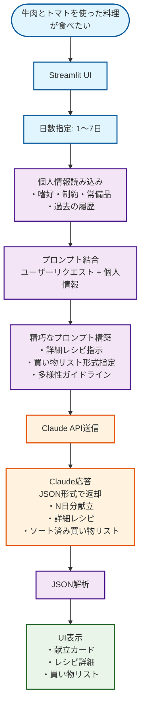
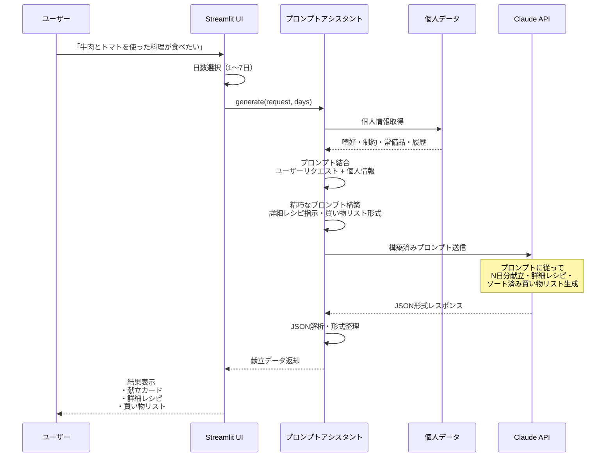
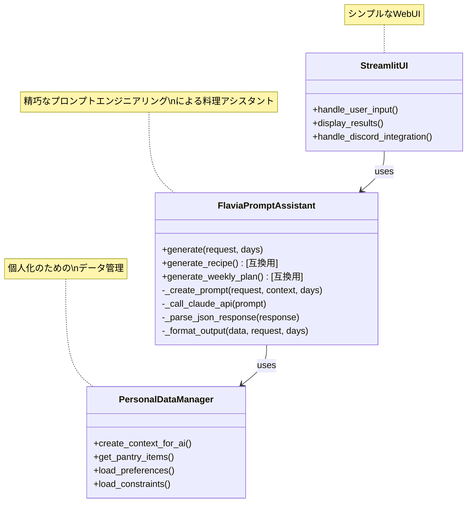

# 🔄 Flavia プロンプトアシスタント フロー

## シンプルなプロンプトアシスタントの処理フロー

## プロンプトアシスタントの実際の動作フロー

## システムアーキテクチャ

## 実際の処理内容

1. **入力受付**: 「牛肉とトマトを使った料理が食べたい」+ 日数選択
2. **個人情報結合**: ユーザーの嗜好・制約・常備品情報を読み込み
3. **プロンプト構築**: 精巧な指示文を作成（詳細レシピ・買い物リスト形式等）
4. **Claude API呼び出し**: 構築したプロンプトをClaude AIに送信
5. **結果解析**: JSON形式の応答を解析・整形
6. **UI表示**: 献立・レシピ・買い物リストを表示

**本質**: AIエージェントではなく、**個人化されたプロンプトエンジニアリングシステム**