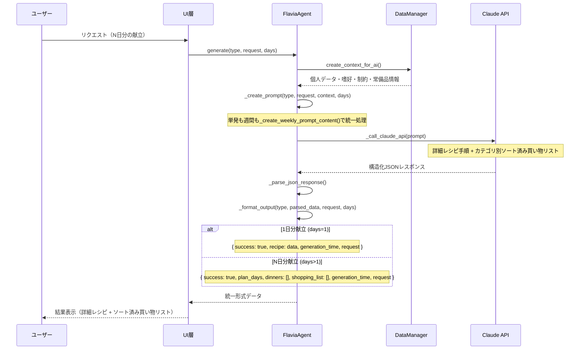
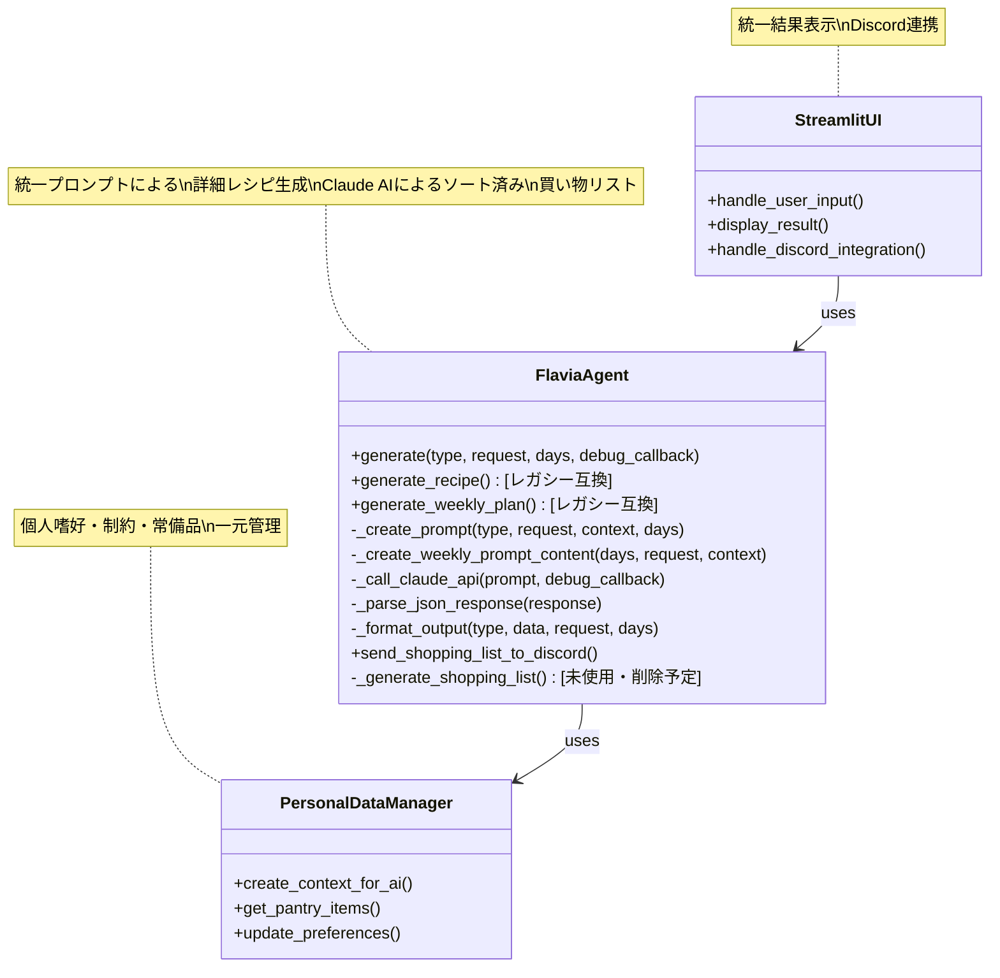

# 🔄 Flavia Agent プロセスフロー

## 統一化されたFlaviaAgentの処理フロー（正式版）

```mermaid
graph TD
    %% メインフロー - 統一化されたパイプライン
    Start([ユーザーリクエスト]) --> SetDays[日数設定: 1日〜N日]
    SetDays --> LoadContext[個人データ読み込み]
    
    LoadContext --> CreatePrompt[統一プロンプト生成]
    CreatePrompt --> CallAI[Claude API呼び出し]
    CallAI --> ParseJSON[JSON解析]
    ParseJSON --> FormatOutput[統一出力形式]
    FormatOutput --> ReturnResult[結果返却]
    
    %% 詳細処理内容
    LoadContext --> LoadPersonalData[個人データ・嗜好・制約読み込み]
    CreatePrompt --> UnifiedPrompt[統一プロンプト<br/>・_create_weekly_prompt_content()で全処理<br/>・詳細レシピ手順<br/>・カテゴリ別買い物リスト<br/>・多様性ガイドライン]
    
    CallAI --> AIResponse[Claude AI応答<br/>・JSON形式<br/>・詳細調理手順<br/>・ソート済み買い物リスト]
    
    FormatOutput --> FormatResult[N日分献立として出力<br/>days=1なら1日分<br/>days=7なら7日分]
    FormatResult --> ReturnResult
    
    %% エラーハンドリング
    LoadContext --> Error{エラー?}
    CreatePrompt --> Error
    CallAI --> Error
    ParseJSON --> Error
    Error -->|Yes| HandleError[統一エラー処理]
    Error -->|No| Continue[処理継続]
    HandleError --> ReturnError[エラー返却]
    Continue --> FormatOutput
    
    %% スタイル定義
    classDef process fill:#f9f,stroke:#333,stroke-width:2px;
    classDef decision fill:#bbf,stroke:#333,stroke-width:2px;
    classDef start fill:#9f9,stroke:#333,stroke-width:2px;
    classDef error fill:#f99,stroke:#333,stroke-width:2px;
    classDef unified fill:#9ff,stroke:#333,stroke-width:3px;
    classDef detail fill:#ffe,stroke:#333,stroke-width:1px;
    
    class Start start;
    class DetermineType,RecipeFormat,Error decision;
    class SetTypeSingle,SetTypeWeekly,LoadContext,CreatePrompt,CallAI,ParseJSON,FormatOutput,SingleRecipe,WeeklyPlan process;
    class HandleError,ReturnError error;
    class LoadPersonalData,WeeklyPrompt,AIResponse detail;
```

## 実装された統一データフロー



## 最終実装のコンポーネント関係



## エラーハンドリングフロー


## 最終実装による改善点

1. **完全統一処理パイプライン**
   - 単発レシピも週間献立も`_create_weekly_prompt_content()`で統一処理
   - 統一プロンプトによる一貫した詳細レシピ生成
   - `generate(type, request, days)` による完全統一インターフェース

2. **詳細レシピ生成の実現**
   - **具体的調理手順**: 火加減・時間・見た目の変化を明記
   - **失敗防止**: ★マークによる重要ポイント強調
   - **初心者対応**: 下ごしらえから仕上げまで詳細記載

3. **買い物リスト最適化**
   - **Claude AIによるカテゴリ別ソート**: 野菜→肉魚→乳製品→調味料→その他
   - **常備品自動除外**: 醤油・塩・胡椒・油等は自動除外
   - **スーパー効率**: 売り場順の並び替えで買い物時間短縮

4. **プロンプト最適化**
   - **多様性ガイドライン**: 3日連続同ジャンル防止・調理法バリエーション
   - **自然言語での明示的指示**: Claude AIが理解しやすい具体的ルール
   - **フォーマット統一**: JSON構造の最適化

5. **レガシー互換性維持**
   - `generate_recipe()` / `generate_weekly_plan()` は内部で統一メソッド呼び出し
   - UI層の変更不要
   - 段階的移行による破壊的変更回避

6. **コード品質向上**
   - 重複コード削除（単発用プロンプト削除）
   - 一元化されたエラーハンドリング
   - 保守性とテスタビリティの向上
