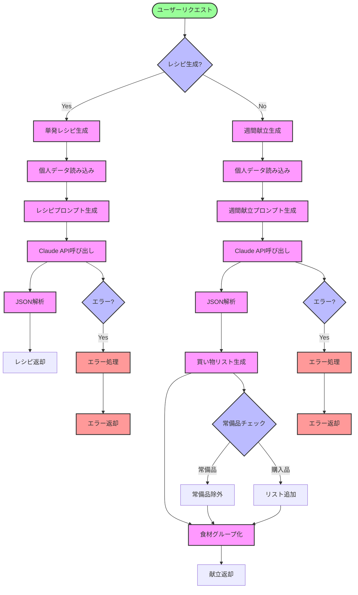
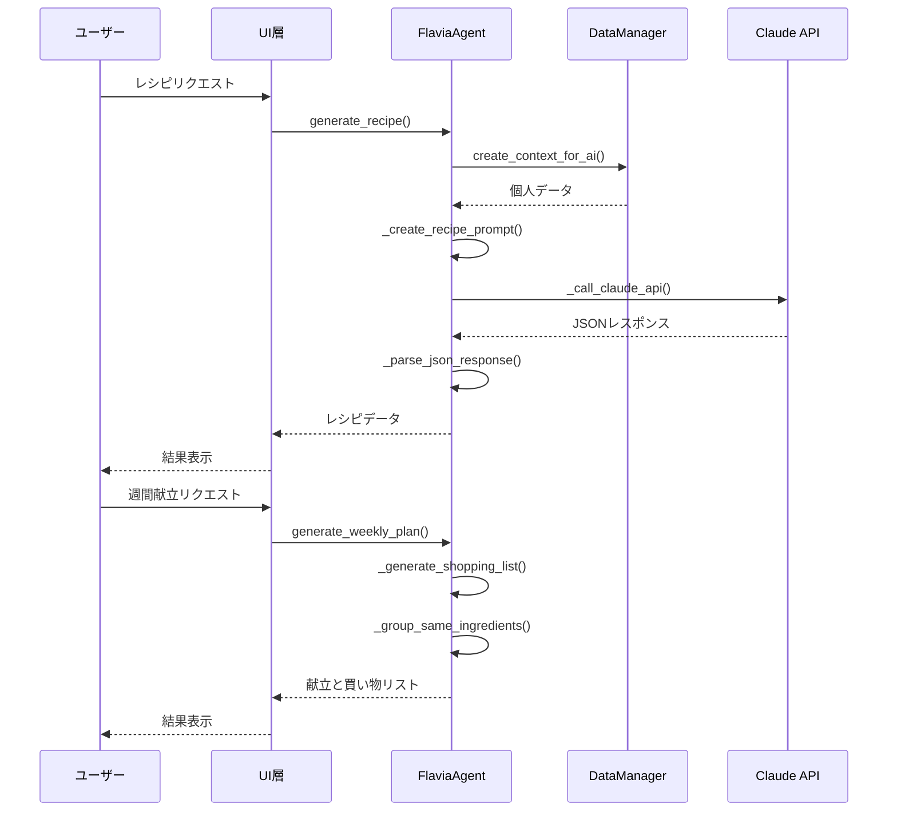
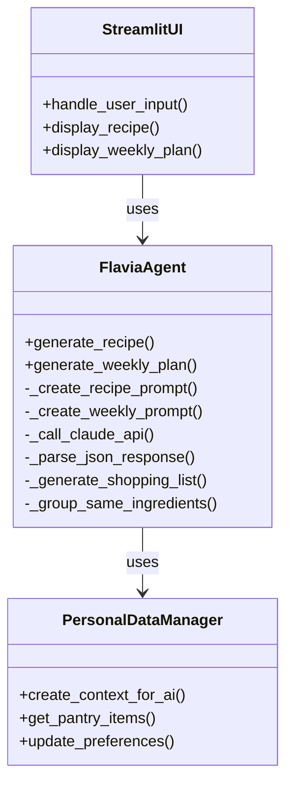
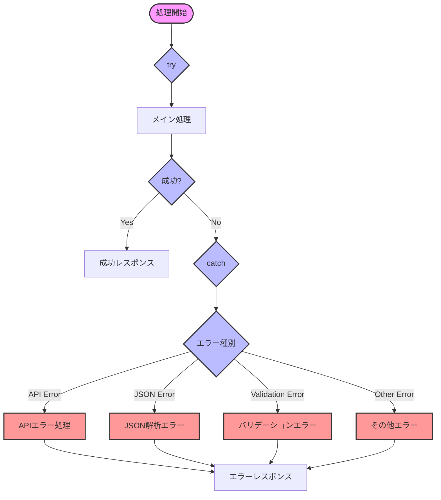

# 🔄 Flavia Agent プロセスフロー

## 現在のFlaviaAgentの処理フロー

## データフロー詳細

## コンポーネント間の関係

## エラーハンドリングフロー

## 補足説明

1. **メインフロー**
   - ユーザーリクエストに基づいて単発レシピ生成か週間献立生成かを判断
   - それぞれの処理フローで個人データの読み込みとAI API呼び出しを実行
   - 週間献立の場合は買い物リスト生成も含む

2. **データフロー**
   - UI層、Agent層、Data層、AI層の4層で構成
   - 各層間のデータの受け渡しを明確化
   - 非同期処理（async/await）の流れを表現

3. **コンポーネント関係**
   - FlaviaAgentを中心とした依存関係
   - 各クラスの主要メソッドを表示
   - コンポーネント間の関連を明確化

4. **エラーハンドリング**
   - try-catchによるエラー処理の流れ
   - エラー種別による分岐処理
   - エラーレスポンスの生成までを表現 
